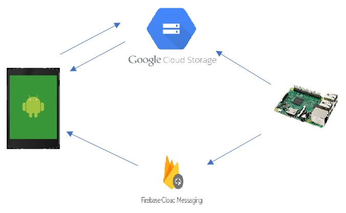

# Raspberry Pi Camera
IoT Raspberry Pi security camera running open-cv for object detection. If the camera detects an object it will send created picture to GoogleCloud and a notification to Android device through FirebaseCloudMessaging. It also runs a server that provides a live video stream over the internet.




##GoogleCloudStorage

There needs to be a bucket created inside GoogleCloudStorage. Since it requires debit card information, this functionality is turned off at the moment. 

After creating a bucket we have to provide its id inside firebase.py file:
```
bucket = storage_client.get_bucket('<bucket_id>')
```
This will allow us to send pictures to that bucket and then download them from that bucket from Android client.

##FirebaseCloudMessaging

In order to notify Android client about object detection notification is send through FirebaseCloudMessaging API. To enable this functionality, API key has to be provided inside firebase.py file:

```
push_service = FCMNotification(api_key="<api_key>")
```
Api-key can be gotten from:  https://console.firebase.google.com/project/<project-name>/settings/cloudmessaging

In order to send notification to Android client it is necessary to provide registration id for each client in firebase.py file:

```
registration_ids = ["<first_id>", "<second_id>",...]
```
These registration ids are obtained from the FirebaseCloudMessaging service when the app starts for the first time.
Registration tokens may change when:

1. The app deletes instance id
2. The app is restored on a new device
3. The user uninstalls/reinstalls the app
4. The user clears app data

Ideally Android client should send its registration id each time it is restored to the server but this functionality is not implemented. Registration ids need to be provide manually for each app.
 

## Setup

This project is modified version of [tutorial](https://www.hackster.io/hackerhouse/smart-security-camera-90d7bd) which sends an email after detecting an object with the camera. Description of setting up the environment is taken directly from the tutorial.


This project uses a Raspberry Pi Camera to stream video. Before running the code, make sure to configure the raspberry pi camera on your device.

Open the terminal and run

```
sudo raspi-config
```

Select `Interface Options`, then `Pi Camera` and toggle on. Press `Finish` and exit.

You can verify that the camera works by running

```
raspistill -o image.jpg
```
which will save a image from the camera in your current directory. You can open up the file inspector and view the image.

## Installing Dependencies

This project uses openCV to detect objects in the video feed. You can install openCV by using the following [tutorial](http://www.pyimagesearch.com/2016/04/18/install-guide-raspberry-pi-3-raspbian-jessie-opencv-3/). I used the Python 2.7 version of the tutorial.

The installation took almost 8 hours (!!) on my Raspberry Pi Zero, but it would be considerably faster on a more powerful board like the Raspberry Pi 3.

The tutorial will prompt you to create a virtual environment. Make sure you are using the virtual environment by typing the following commands

```bash
source ~/.profile
workon cv
```

Next, navigate to the repository directory

```
cd Smart-Security-Camera
```

and install the dependencies for the project

```
pip install -r requirements.txt
```

You can also modify the `main.py` file to change some other properties.

```
email_update_interval = 20 # sends photo to cloud only once in this time interval
video_camera = VideoCamera(flip=True) # creates a camera object, flip vertically
object_classifier = cv2.CascadeClassifier("models/fullbody_recognition_model.xml") # an opencv classifier
```
Notably, you can use a different object detector by changing the path `"models/fullbody_recognition_model.xml"` in `object_classifier = cv2.CascadeClassifier("models/fullbody_recognition_model.xml")`.

to a new model in the models directory.

```
facial_recognition_model.xml
fullbody_recognition_model.xml
upperbody_recognition_model.xml
```

## Running the Program

Run the program

```
python main.py
```

You can view a live stream by visiting the ip address of your pi in a browser on the same network. You can find the ip address of your Raspberry Pi by typing `ifconfig` in the terminal and looking for the `inet` address. 

Visit `<raspberrypi_ip>:5000` in your browser to view the stream.

Note: To view the live stream on a different network than your Raspberry Pi, you can use [ngrok](https://ngrok.com/) to expose a local tunnel. Once downloaded, run ngrok with `./ngrok http 5000` and visit one of the generated links in your browser.

Note: The video stream will not start automatically on startup. To start the video stream automatically, you will need to run the program  from your `/etc/rc.local` file see this [video](https://youtu.be/51dg2MsYHns?t=7m4s) for more information about how to configure that.
